# Finora

> A modern, offline-first personal finance and expense tracker built with Flutter and Firebase.

Finora is a feature-rich, premium personal finance assistant designed to help users manage their money, set custom budgets, track savings goals, and visualize spending habits through beautiful charts. Built with a local-first architecture, it ensures offline capabilities while seamlessly syncing with Firebase when a network connection is available.

---

## 📋 Table of Contents

1. [Overview](#-overview)
2. [Key Features](#-key-features)
3. [Screenshots](#-screenshots)
4. [Tech Stack & Libraries](#-tech-stack--libraries)
5. [Architecture & Project Structure](#-architecture--project-structure)
6. [Getting Started](#-getting-started)
   - [Prerequisites](#prerequisites)
   - [Installation](#installation)
   - [Firebase Setup](#firebase-setup)
   - [API Configuration](#api-configuration)
7. [Usage Guide](#-usage-guide)
8. [Academic Context](#-academic-context)
9. [Contributing](#-contributing)
10. [License](#-license)
11. [Contact / Authors](#-contact--authors)

---

## 🔍 Overview

Finora is designed to simplify personal finance management for modern users. With its clean user interface, harmonic color palette, and micro-animations, the app elevates the day-to-day experience of tracking transactions. By prioritizing user privacy and reliability, Finora utilizes a local-first sqlite database, ensuring that transactions, budgets, and savings goals are stored instantly and remain accessible regardless of connectivity.

When users log into their accounts, their local data is synchronized securely with Cloud Firestore, enabling multi-device access. Finora also supports guest mode using Firebase Anonymous Auth, keeping data private and isolated on a per-user basis. Through local push notifications, interactive fl_chart visuals, and real-time ExchangeRate-API currency conversions, Finora acts as an all-in-one financial dashboard.

---

## ✨ Key Features

### 🔐 Authentication
- **Secure Sign-In**: Login and Registration via Email/Password.
- **Single Sign-On**: Integrated Google Sign-In support.
- **Guest Mode**: Access key features instantly via Firebase Anonymous Auth, maintaining complete session data isolation.
- **Reset Password**: Simple forgot-password recovery system.

### 💸 Transaction Management
- **Expense & Income Tracking**: Categorized transactions with note fields, custom dates, and payment methods (Card, Cash, etc.).
- **Receipt Capture**: Attach photo receipts which are saved locally and synced to Firebase Storage.
- **Quick Searching**: Real-time searching and filtering of transactions by category, type, and date range.

### 📊 Budget Management
- **Category & Overall Limits**: Set monthly spending limits globally or scope them to specific expense categories.
- **Interactive Threshold Alerts**: Real-time visual warnings (progress bars) and push notifications when spending reaches 80% and 100% of limits.
- **Inline Editing/Deleting**: Modify budget amounts or delete configurations on the fly with immediate UI refreshes.
- **Month Navigation**: Select and view historical budgets or configure future limits using simple month selectors.

### 🎯 Savings Goals
- **Savings Plans**: Set target amounts and dates to keep track of financial milestones (e.g. buying a laptop or traveling).
- **Contributions History**: Log progress updates and review detailed deposit history for each saving target.

### 📈 Analytics & Reports
- **Visual Analytics**: Interactive pie charts and category breakdown chips illustrating monthly spending.
- **Exporting Options**: Generate and export financial reports to CSV or print-ready PDF formats.

### 🔔 Notifications
- **Smart Reminders**: Automated daily reminders reminding users to log their expenses.
- **System History**: A dedicated notification log to view previously fired budget warnings and daily reminders.

### 🌐 Currency & Personalization
- **Multi-Currency Support**: Real-time conversion between major global currencies (USD, EUR, GBP, PKR, INR, JPY, AED, SAR, CNY, AUD, CAD) using ExchangeRate-API.
- **Dynamic Themes**: Seamless switching between light mode, dark mode, and customizable system fonts.

---

## 📱 Screenshots

### Onboarding & Authentication
<table>
  <tr>
    <td align="center" valign="top" width="25%">
      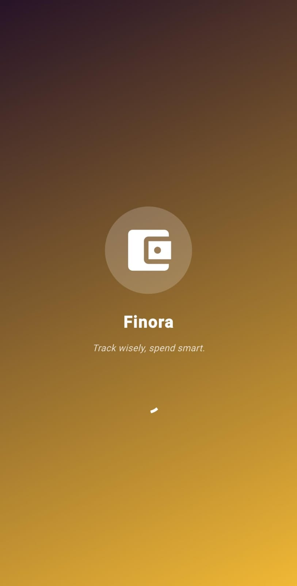<br/>
      <sub><b>Splash Screen</b></sub>
    </td>
    <td align="center" valign="top" width="25%">
      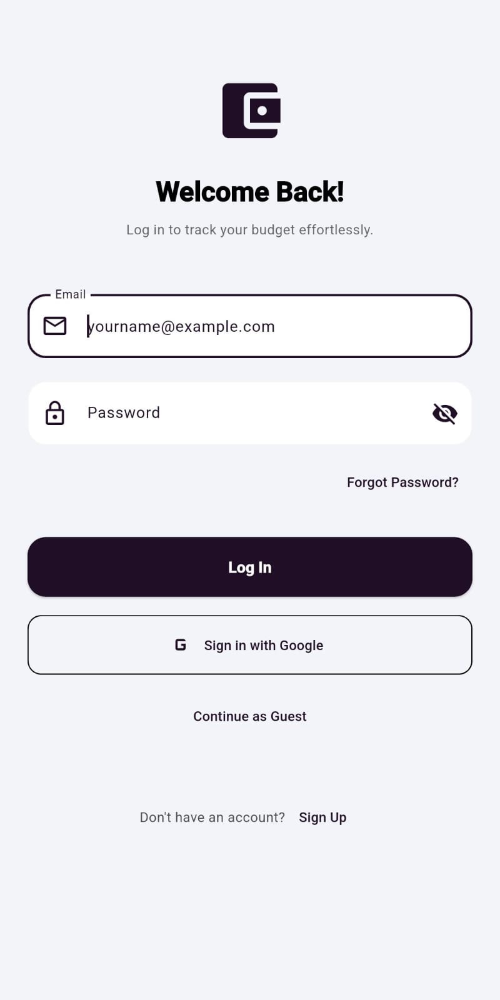<br/>
      <sub><b>Login</b></sub>
    </td>
    <td align="center" valign="top" width="25%">
      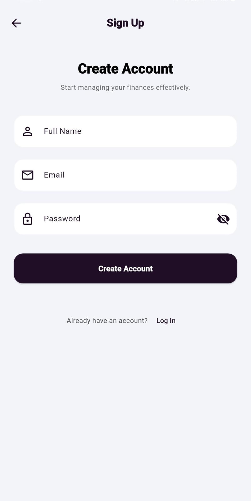<br/>
      <sub><b>Signup</b></sub>
    </td>
    <td align="center" valign="top" width="25%">
      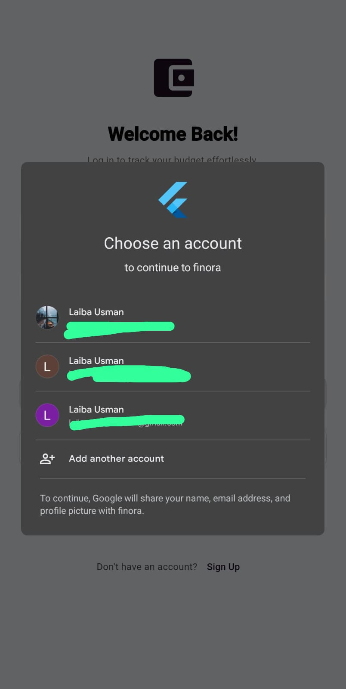<br/>
      <sub><b>Google Sign-In</b></sub>
    </td>
  </tr>
</table>

### Dashboard & Transactions
<table>
  <tr>
    <td align="center" valign="top" width="50%">
      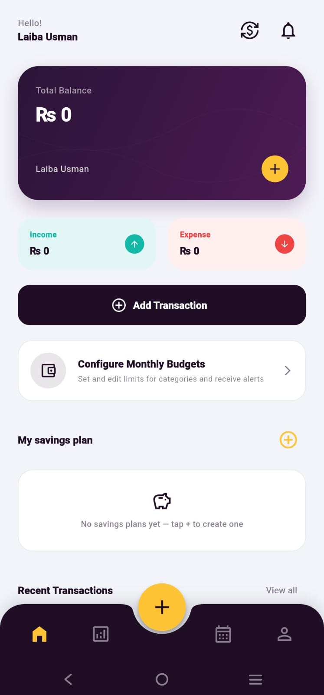<br/>
      <sub><b>Home Dashboard</b></sub>
    </td>
    <td align="center" valign="top" width="50%">
      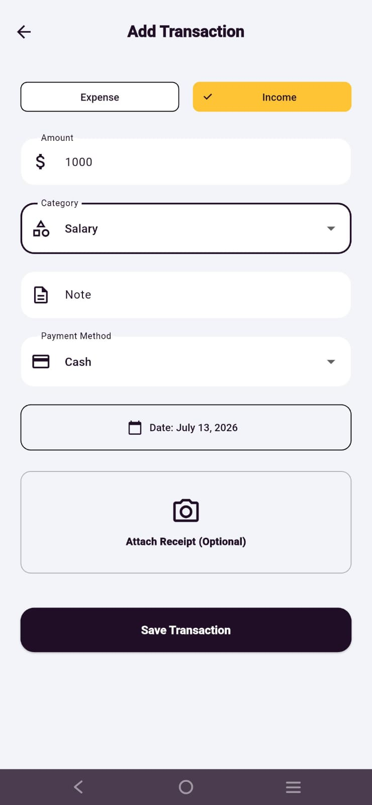<br/>
      <sub><b>Add Transaction Form</b></sub>
    </td>
  </tr>
</table>

### Budgets & Alerts
<table>
  <tr>
    <td align="center" valign="top" width="20%">
      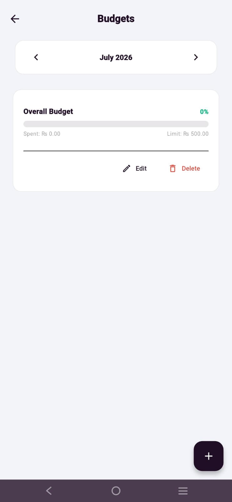<br/>
      <sub><b>Budgets Screen</b></sub>
    </td>
    <td align="center" valign="top" width="20%">
      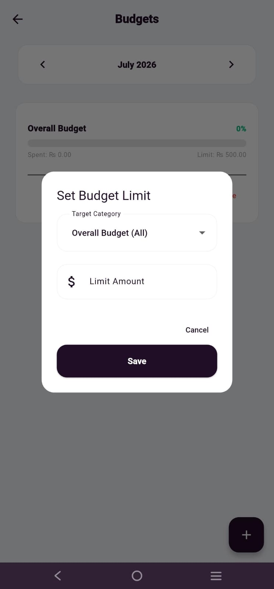<br/>
      <sub><b>Set Monthly Budget</b></sub>
    </td>
    <td align="center" valign="top" width="20%">
      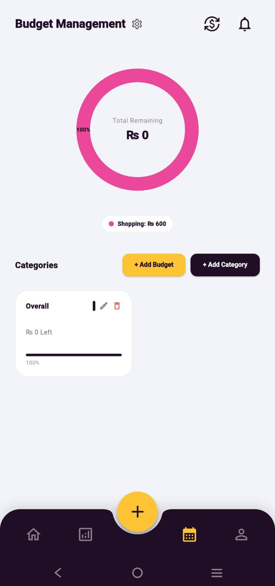<br/>
      <sub><b>Budget Management Tab</b></sub>
    </td>
    <td align="center" valign="top" width="20%">
      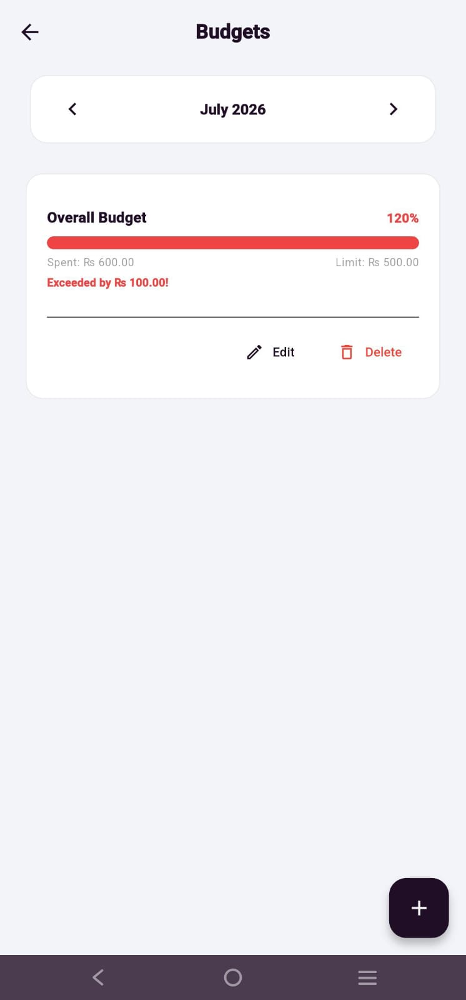<br/>
      <sub><b>Limit Alert</b></sub>
    </td>
    <td align="center" valign="top" width="20%">
      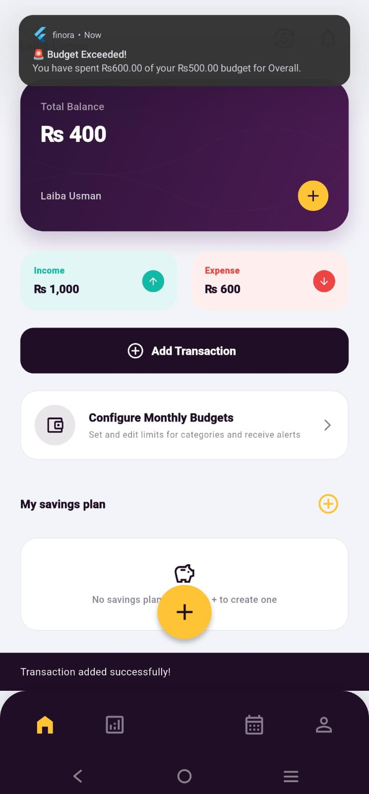<br/>
      <sub><b>Push Notification</b></sub>
    </td>
  </tr>
</table>

### Savings Plans
<table>
  <tr>
    <td align="center" valign="top" width="33%">
      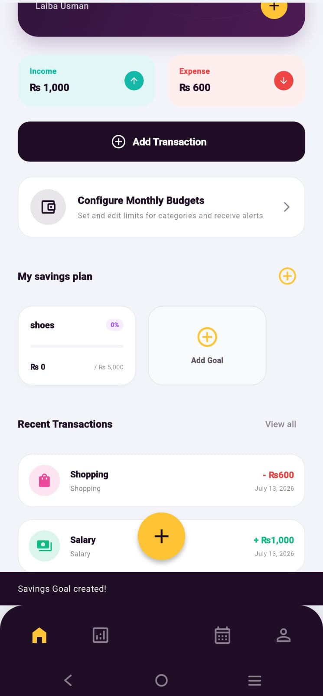<br/>
      <sub><b>Savings Plan Home</b></sub>
    </td>
    <td align="center" valign="top" width="33%">
      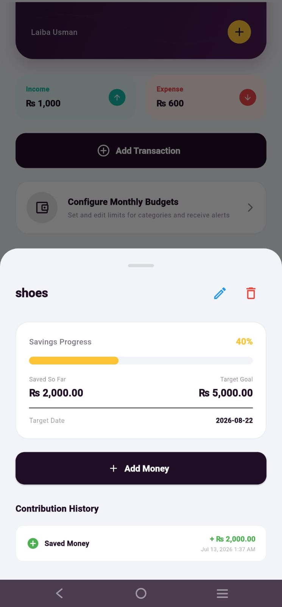<br/>
      <sub><b>Savings Details</b></sub>
    </td>
    <td align="center" valign="top" width="33%">
      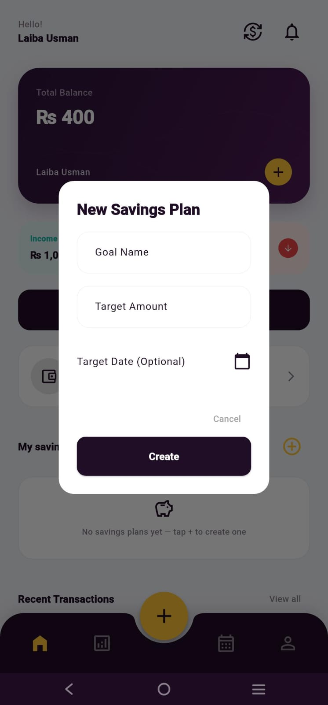<br/>
      <sub><b>Add Savings Plan Dialog</b></sub>
    </td>
  </tr>
</table>

### Statistics, Notifications & Personalization
<table>
  <tr>
    <td align="center" valign="top" width="25%">
      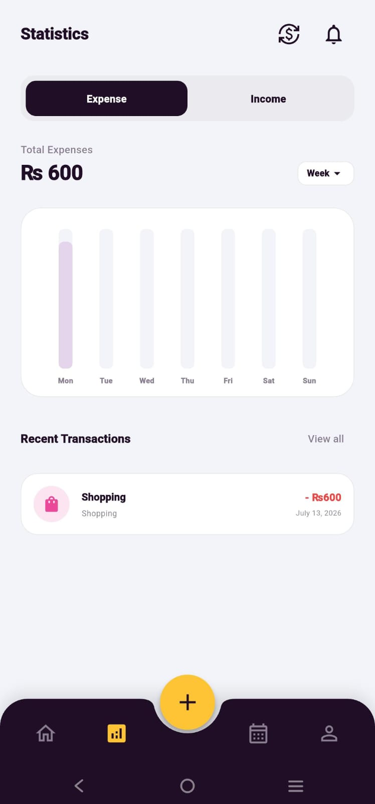<br/>
      <sub><b>Interactive Charts</b></sub>
    </td>
    <td align="center" valign="top" width="25%">
      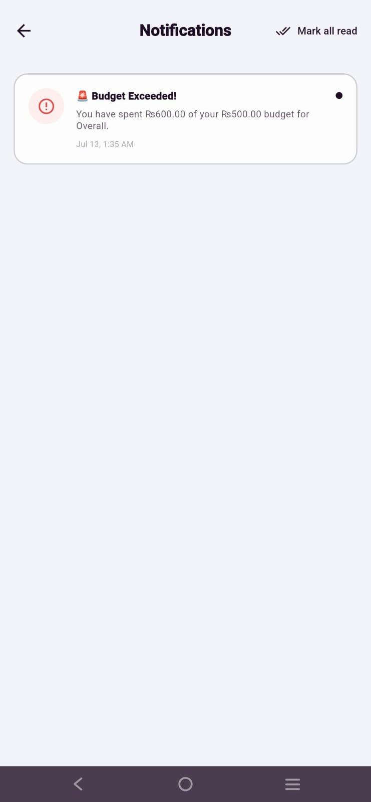<br/>
      <sub><b>Reminders History</b></sub>
    </td>
    <td align="center" valign="top" width="25%">
      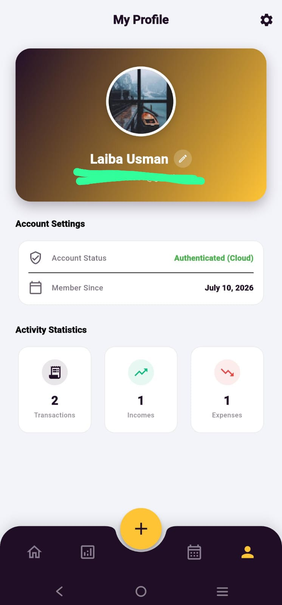<br/>
      <sub><b>User Profile</b></sub>
    </td>
    <td align="center" valign="top" width="25%">
      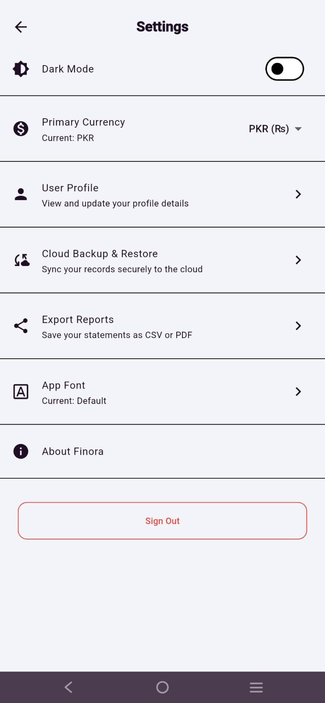<br/>
      <sub><b>App Settings</b></sub>
    </td>
  </tr>
</table>

### Reports & Exporting
<table>
  <tr>
    <td align="center" valign="top" width="50%">
      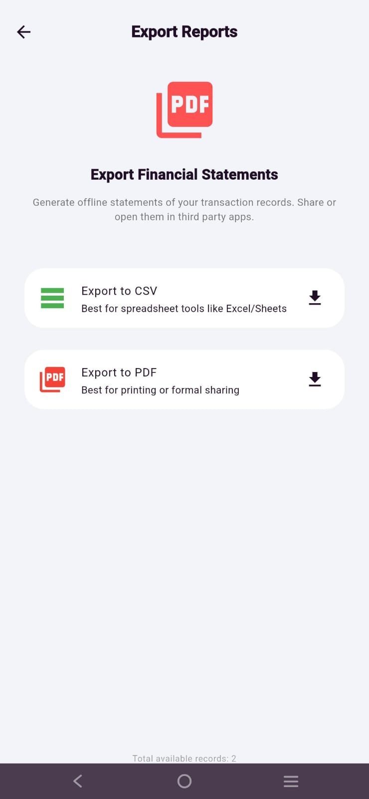<br/>
      <sub><b>Export Options</b></sub>
    </td>
    <td align="center" valign="top" width="50%">
      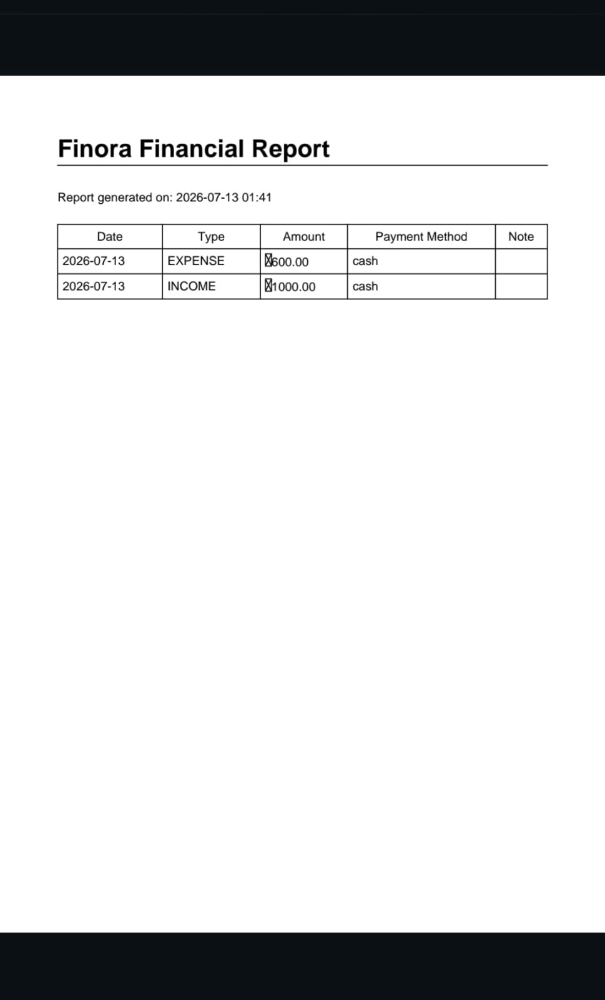<br/>
      <sub><b>PDF Layout</b></sub>
    </td>
  </tr>
</table>

---

## 🛠 Tech Stack & Libraries

- **Framework**: [Flutter SDK](https://flutter.dev/) (Builds for iOS & Android)
- **Language**: [Dart](https://dart.dev/)
- **State Management**: [Provider Package](https://pub.dev/packages/provider)
- **Local SQLite Database**: [sqflite](https://pub.dev/packages/sqflite) (with FFI support for unit testing on desktop environments)
- **Cloud Backend**: 
  - [Firebase Auth](https://firebase.google.com/docs/auth) (Sign-in flows and session security)
  - [Cloud Firestore](https://firebase.google.com/docs/firestore) (Live data backups and sync)
  - [Firebase Storage](https://firebase.google.com/docs/storage) (Receipt image upload)
  - [Firebase Cloud Messaging](https://firebase.google.com/docs/cloud-messaging) (Cloud reminders)
- **Local Alerts**: [flutter_local_notifications](https://pub.dev/packages/flutter_local_notifications)
- **Charts**: [fl_chart](https://pub.dev/packages/fl_chart)
- **External Currency APIs**: [ExchangeRate-API](https://www.exchangerate-api.com/)
- **Document Generation**: [pdf](https://pub.dev/packages/pdf) & [csv](https://pub.dev/packages/csv)

---

## 🏗 Architecture & Project Structure

Finora uses a clean separation of concerns grouping directory files by their functional layer:

```text
lib/
├── app/               # Main application routing and widget registry
├── config/            # Styling Constants, API Configs, harmonized color tokens
├── database/          # DbHelper and DAO (Data Access Object) database layer
├── models/            # Domain models (Transaction, Category, Budget, etc.)
├── providers/         # Providers handling reactive State Management (CRUD triggers)
├── screens/           # UI Presentation layer grouped by feature screens
│   ├── auth/
│   ├── budget/
│   ├── currency_converter/
│   ├── dashboard/
│   ├── export/
│   └── settings/
├── services/          # Service layer (Firestore, Local Notifications, Storage)
├── utils/             # Formatters, UI helpers, and input validators
└── widgets/           # Shared reusable custom UI components
```

---

## 🚀 Getting Started

Follow these steps to set up a local copy of Finora:

### Prerequisites
- **Flutter SDK**: `^3.0.0`
- **Dart SDK**: `^3.0.0`
- **Android Studio** / **VS Code** (with Flutter extensions)

### Installation
1. Clone the repository:
   ```bash
   git clone https://github.com/yourusername/finora.git
   cd finora
   ```
2. Install dependencies:
   ```bash
   flutter pub get
   ```

### Firebase Setup
1. Install the FlutterFire CLI (if not already done):
   ```bash
   dart pub global activate flutterfire_cli
   ```
2. Configure Firebase in the project directory:
   ```bash
   flutterfire configure
   ```
3. Follow the prompt to select/create your Firebase project. The CLI automatically registers your Android/iOS profiles and creates the `firebase_options.dart` configuration file inside `lib/`.
4. Ensure `google-services.json` (Android) and `GoogleService-Info.plist` (iOS) are generated in their respective native directories.

### API Configuration
To enable the Currency Converter screen:
1. Sign up on [ExchangeRate-API](https://www.exchangerate-api.com/) to receive your API Key.
2. In your local directory, locate `lib/config/api_keys.dart` (or create it if it's missing):
   ```dart
   // lib/config/api_keys.dart
   class ApiKeys {
     static const String exchangeRateApiKey = 'YOUR_API_KEY_HERE';
   }
   ```
3. Replace `'YOUR_API_KEY_HERE'` with your actual API key.
4. *Note: `lib/config/api_keys.dart` is added to `.gitignore` to prevent your credentials from being pushed to public source control.*

---

## 💡 Usage Guide

- **Logging Transactions**: Tap the yellow `+` FAB on the Bottom Navigation Bar. Fill in the amount, select an Income/Expense type, assign a Category, specify details, attach a photo receipt, and click save.
- **Configuring Budgets**: Go to the **Budget Management** tab or tap **Configure Monthly Budgets** card on the Home Dashboard. Navigate months, configure overall or category specific budgets, and instantly view alerts if your expenses cross thresholds.
- **Monitoring Goals**: Add plans under **My savings plan** section. Tap any savings target to view details and log contributions as you save.
- **Currency Conversions**: Tap the exchange icon next to the notification bell in the top-right header. Input amounts and select base/destination currencies to review exchange calculations.

---

## ✉️ Contact / Authors

- **Author Name**: [Laiba Usman](https://github.com/Laiba-Usman)
- **Project Link**: [https://github.com/Laiba-Usman/Finora](https://github.com/Laiba-Usman/Finora)
